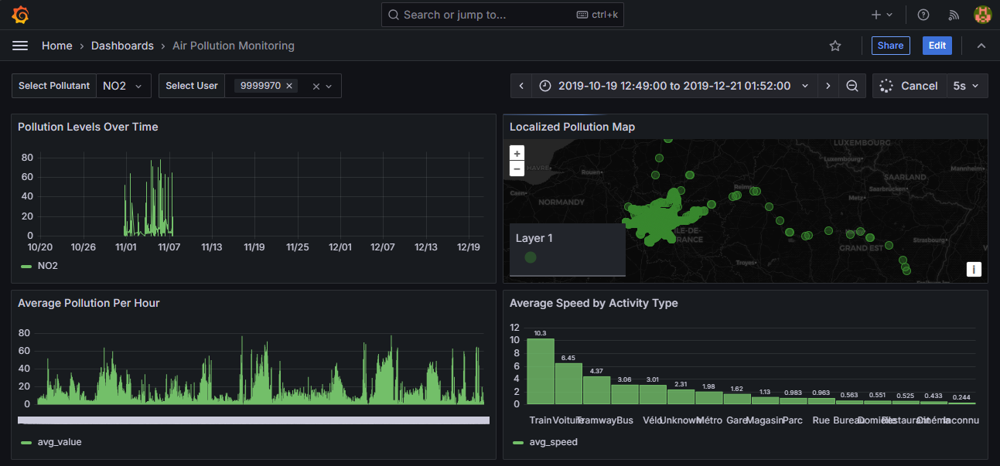

# Air Pollution Monitoring with Grafana

## Overview

This project provides a **Grafana-based dashboard** for monitoring **air pollution levels** using data from sensors. The system enables users to visualize pollution trends over time, analyze environmental factors affecting pollution, and track user trajectories.

The project integrates:
- **PostgreSQL + TimescaleDB** for storing pollution and GPS data
- **Grafana** for real-time dashboard visualization
- **Docker** for easy deployment

## Architecture

The project consists of the following components:

- **PostgreSQL + TimescaleDB**: Stores sensor data (`data_processed_vgp_cleaned`) and GPS trajectory data (`clean_gps_cleaned`).
- **Grafana**: Reads data from PostgreSQL and provides an interactive dashboard.
- **Docker Compose**: Automates service deployment.
- **Python Import Script (`import_data.py`)**: Loads pollution data into the database.

### Data Flow

1. **Data Collection**: Pollution sensors collect environmental data.
2. **Storage**: Data is stored in PostgreSQL tables (`data_processed_vgp_cleaned` for pollution, `clean_gps_cleaned` for GPS).
3. **Visualization**: Grafana dashboards display insights dynamically.
4. **User Interaction**: Users select pollutants, date ranges, and user trajectories for detailed analysis.

---

## How to Run the Project

### 1. Clone the Repository

```bash
git clone https://github.com/JEMALIACHRAF/grafana.git
cd grafana
```

### 2. Start the Services

Make sure **Docker** is installed, then run:

```bash
docker-compose up -d
```

This will:
- Start PostgreSQL with TimescaleDB.
- Start Grafana and provision the dashboards.

### 3. Import Data

Before using Grafana, you need to **populate the database**:

```bash
python import_data.py
```

This script will:
- Load pollution data into `data_processed_vgp_cleaned`.
- Load GPS trajectory data into `clean_gps_cleaned`.

### 4. Access Grafana Dashboard

- Open **Grafana** in your browser:  
  👉 [http://localhost:3000](http://localhost:3000)
- Default login:
  - **Username**: `admin`
  - **Password**: `admin`

### 5. Configure Grafana (Optional)

If the dashboard doesn’t appear, check:
- **Grafana Configuration** (`config/grafana.ini`)
- **Dashboard provisioning** (`config/provisioning/dashboards.yaml`)

---

## Grafana Dashboard Features

The dashboard provides various insights into air pollution and user activity.

### 1. **Pollution Levels Over Time**
   - Line chart showing pollution trends.

### 2. **Localized Pollution Map**
   - Displays pollution hotspots using **geo-coordinates**.

### 3. **User Trajectory Map**
   - **Tracks the movement** of selected users using **red lines** instead of points.

### 4. **Impact of Humidity on Pollution**
   - Analyzes how humidity affects pollution levels.

### 5. **Correlation Analysis**
   - Computes **correlation between temperature, humidity, and pollution**.

### 6. **Pollution Levels Across Activities**
   - Compares pollution exposure across activities (e.g., **cycling, driving, metro**).

### Example Dashboard Views:

**1. Main Pollution Monitoring View**  


**2. User Trajectory & Humidity Impact**  


---

## Troubleshooting

### Grafana Dashboard Not Loading?
1. Restart services:  
   ```bash
   docker-compose restart
   ```
2. Check logs:  
   ```bash
   docker logs <container_name>
   ```

### No Data in Dashboards?
- Ensure `import_data.py` has been executed.
- Verify PostgreSQL tables contain records:  
  ```sql
  SELECT * FROM data_processed_vgp_cleaned LIMIT 10;
  ```

### User Trajectory Appears as Points Instead of Lines?
- Verify **dashboard.json** contains:
  ```json
  "lineColor": "red",
  "showLines": true,
  "showPoints": false
  ```
- Ensure Grafana correctly loads the modified dashboard.


